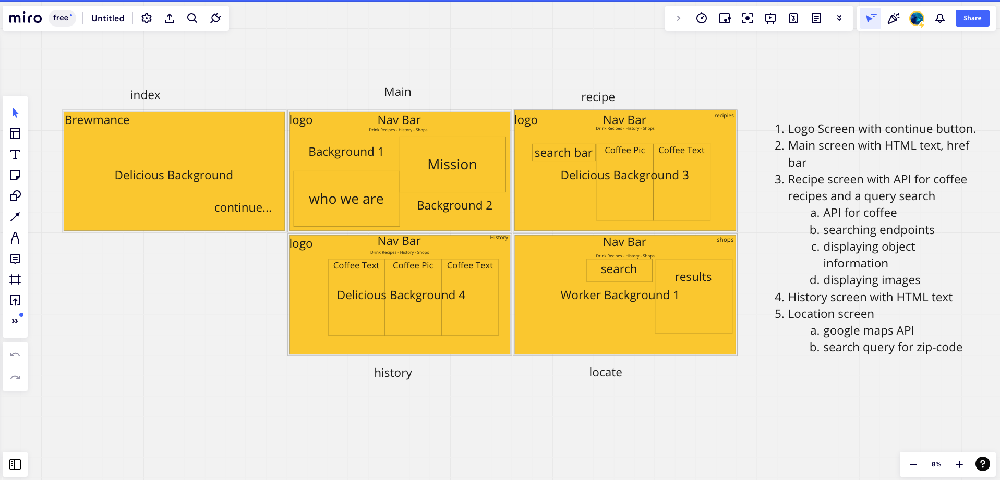

# What is Brewmance?

- Brewmance is a mixture of node, template, and html to create a recipe web application with coffee as the star ingredient. Whether you love coffee or want to begin a new journey, the API call from Spoonacular will dynamically display recipes to cycle through. Information about coffee can be found with a Google Map API as well.

# Why Brewmance?

- My mom loves coffee. I do not. But I do bake and the recipes found within have a lot of creative and tasty dishes that are easy to make.

- I also wanted to take on the task of writing code outside of a framework like React. Practicing my template and back-end skills.

## This is how I get started with apps and web pages.

# Struggles

- The Dom loading before the API call

  - This wasn't a struggle but required useEffect to call the API after the component mounted.

- useEffect runs each time a change is made the DOM

  - I was getting stacks and doubles of my API call. Luckily this only happens in dev mode. I removed the restrict tags so I could avoid this in testing before pushing to prod.

- Iterating through the array of data and posting the data 1 at a time while hiding the reamining data.

  - I wanted to use a useState here to and set the increment veriable to the index of the array of elements. I decided to just use my old code from the previous version so I could save time on the project.

- Deployed using Surge, [Brewmance](http://brewmance.online) 

# Overall

- About half way through this project I learned that I should have started the original product in React to begin with.

You can use this link to get back to [my portfolio](http://dave2dev.com/).
